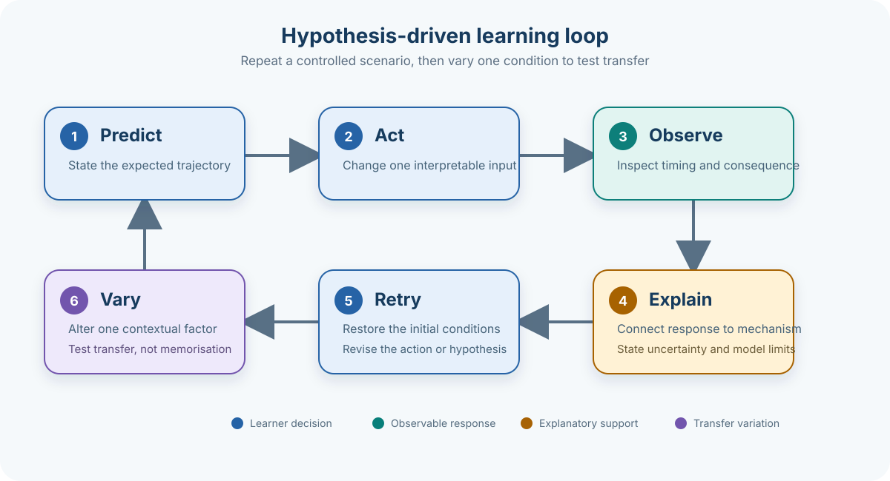

## Practice a capability, not a score

A game should specify what the learner must recall, explain, perform or discuss. Repeated success within its own rules is not sufficient evidence of that capability: assessment must match the intended construct ([Gris and Bengtson, 2021](https://doi.org/10.17083/ijsg.v8i1.383)). Product-specific results for type 1 diabetes (T1D) are collected in the [evidence map](../games/evidence-map.qmd).

**Deliberate practice** means targeted attempts at a specific weakness, with informative feedback and opportunities to revise performance—not simply accumulating play time ([Ericsson et al., 1993](https://doi.org/10.1037/0033-295X.100.3.363)). This principle comes from expertise research, not a demonstrated T1D-game effect. Reviews of educational games find learning benefits on average, but effects depend on design and instructional context ([Wouters et al., 2013](https://doi.org/10.1037/a0031311); [Clark et al., 2016](https://doi.org/10.3102/0034654315582065)).

## Simulation as hypothesis testing

For a causal-learning simulation, a proposed activity sequence is:

Ask for a prediction before revealing the outcome. After the action, show the relevant trajectory and explain the discrepancy. Replay from the same initial state while changing one condition; later vary the starting state as well. Holding other conditions constant makes the comparison interpretable. These are **design inferences**, not evidence that this exact sequence improves T1D outcomes.

Delayed processes require explicit time information. If an action starts now but its effect peaks later, the interface should distinguish action time, ongoing activity and observed consequence. The [physiology chapters](../physiology/index.qmd) describe the relevant delays; the [model chapter](../physiology/model-families.qmd) addresses model validity.

## Feedback that explains the error

Formative feedback provides information the learner can use to improve an attempt. Reviews distinguish task-specific and process-level information from generic praise ([Shute, 2008](https://doi.org/10.3102/0034654307313795); [Hattie and Timperley, 2007](https://doi.org/10.3102/003465430298487)).

| Feedback component | Example in a glucose simulation |
|---|---|
| Observed result | Identify when the trajectory diverged from the prediction. |
| Causal explanation | Show which delayed processes overlapped. |
| Model boundary | Identify an omitted or simplified process relevant to this case. |
| Next attempt | Invite a change to one variable and a new prediction. |

This example is a design proposal. Adjacent experimental support comes from two university-student experiments: explanation feedback, compared with correct-answer feedback, improved delayed inference performance; analysed samples were 60 and 24 students. The tasks concerned reading and inference, not diabetes management ([Butler et al., 2013](https://sites.wustl.edu/mdl1/files/2026/06/Butler-et-al.-2013-Explanation-feedback-is-better-than-correct-answer-feedback-for-promoting-transfer-of-learning.pdf)).

## Scaffolding and its removal

**Scaffolding** is temporary instructional support: a worked example, prediction choices, a highlighted variable or an explanatory cue. A meta-analysis supports achievement benefits in digital game-based learning, with variation between implementations ([Cai et al., 2022](https://doi.org/10.1007/s10648-021-09655-0)). It does not identify a universally optimal tutorial length.

A testable progression is to demonstrate one case, guide a second and remove support on a third. Increase complexity by combining previously learned relations, rather than concealing essential information. Assess performance after cues are withdrawn; otherwise the interface may be supplying the reasoning attributed to the learner.

## Retrieval, variation and transfer

**Retrieval practice** requires recalling or reconstructing an answer before seeing it again. Experiments outside diabetes show that testing can improve delayed retention and, under studied conditions, transfer relative to repeated study ([Roediger and Karpicke, 2006](https://doi.org/10.1111/j.1467-9280.2006.01693.x); [Butler, 2010](https://doi.org/10.1037/a0019902)).

In a T1D game, a prediction, explanation or ordering task can require retrieval without a separate quiz screen. Vary meal timing, context or available information so that memorising one action sequence is insufficient. Space later attempts rather than equating immediate retries with durable retention. These applications remain design hypotheses.

**Transfer** means applying learning to an unpractised task or context. Three complementary probes for causal learning are: predict an unseen trajectory, select an intervention under changed constraints, and explain why the original strategy no longer works. The [evaluation chapter](evaluation.qmd) covers delayed testing, scoring and comparators.

Narrative, shared play and motivation are treated in [game mechanisms](game-mechanisms.qmd); procedure-related distress and psychosocial findings remain in the [evidence map](../games/evidence-map.qmd). Neither simulation nor a glucose model is necessary for every T1D learning objective.

## References

- [Butler, A.C., Godbole, N. and Marsh, E.J. (2013) “Explanation feedback is better than correct answer feedback for promoting transfer of learning”, *Journal of Educational Psychology*, 105(2), pp. 290–298.](https://sites.wustl.edu/mdl1/files/2026/06/Butler-et-al.-2013-Explanation-feedback-is-better-than-correct-answer-feedback-for-promoting-transfer-of-learning.pdf)

- [Butler, A.C. (2010) “Repeated testing produces superior transfer of learning relative to repeated studying”, *Journal of Experimental Psychology: Learning, Memory, and Cognition*, 36(5), pp. 1118–1133.](https://doi.org/10.1037/a0019902)

- [Cai, Z. et al. (2022) “Effects of scaffolding in digital game-based learning on students’ achievement: a three-level meta-analysis”, *Educational Psychology Review*, 34, pp. 537–574.](https://doi.org/10.1007/s10648-021-09655-0)

- [Clark, D.B., Tanner-Smith, E.E. and Killingsworth, S.S. (2016) “Digital games, design, and learning: a systematic review and meta-analysis”, *Review of Educational Research*, 86(1), pp. 79–122.](https://doi.org/10.3102/0034654315582065)

- [Ericsson, K.A., Krampe, R.T. and Tesch-Römer, C. (1993) “The role of deliberate practice in the acquisition of expert performance”, *Psychological Review*, 100(3), pp. 363–406.](https://doi.org/10.1037/0033-295X.100.3.363)

- [Gris, G. and Bengtson, C. (2021) “Assessment measures in game-based learning research: a systematic review”, *International Journal of Serious Games*, 8(1), pp. 3–26.](https://doi.org/10.17083/ijsg.v8i1.383)

- [Hattie, J. and Timperley, H. (2007) “The power of feedback”, *Review of Educational Research*, 77(1), pp. 81–112.](https://doi.org/10.3102/003465430298487)

- [Roediger, H.L. and Karpicke, J.D. (2006) “Test-enhanced learning: taking memory tests improves long-term retention”, *Psychological Science*, 17(3), pp. 249–255.](https://doi.org/10.1111/j.1467-9280.2006.01693.x)

- [Shute, V.J. (2008) “Focus on formative feedback”, *Review of Educational Research*, 78(1), pp. 153–189.](https://doi.org/10.3102/0034654307313795)

- [Wouters, P. et al. (2013) “A meta-analysis of the cognitive and motivational effects of serious games”, *Journal of Educational Psychology*, 105(2), pp. 249–265.](https://doi.org/10.1037/a0031311)
