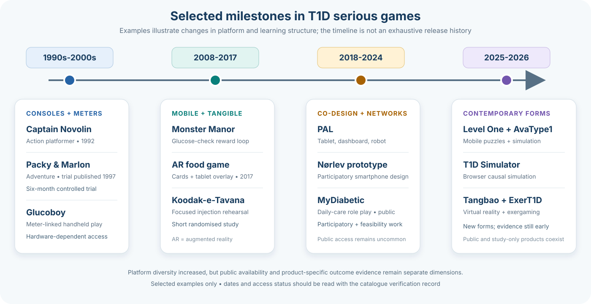

Type 1 diabetes (T1D) games span procedural rehearsal, glucose simulation, character care, coping and experiential narrative. The [catalogue](../../explorer.html) contains their descriptions, dates, languages and access routes; the [evidence map](evidence-map.qmd) contains outcome findings.

## How the field developed

Early console games embedded diabetes tasks in platform adventures. Later products used mobile quizzes, virtual pets and rewards linked to real monitoring. Research programmes also explored augmented reality, social robots and immersive virtual reality. Recent browser and mobile products include both explicit glucose simulations and narratives concerned with living with diabetes. Product-specific histories and sources are in the [catalogue](../../explorer.html).

A paediatric T1D review identified 23 studies: 52% concerned mobile applications, 35% included social features and 70% lacked an explicit theoretical framework. Those frequencies describe the reviewed interventions, not which mechanisms caused benefit ([Guan et al., 2026](https://doi.org/10.1186/s12887-026-07142-5)).

## Different purposes require different evidence

A **serious game** has a purpose beyond entertainment. **Gamification** adds game elements to an otherwise non-game activity; rewarding logging is therefore distinct from practising glucose interpretation. A **simulation** represents a system, whereas an **experiential game** represents aspects of an experience. These categories can overlap.

Physiological fidelity matters when a game teaches glucose dynamics. A narrative about disclosure or social burden needs appropriate experiential and psychosocial appraisal, not necessarily a glucose model. Neither interface polish nor mechanistic detail establishes learning.

Research on newly diagnosed adults, delayed transfer and long-term use remains limited in the reviewed corpus. Read the [evidence map](evidence-map.qmd) for the specific findings and uncertainty, [design comparisons](../comparisons/comparative-analysis.qmd) for interaction differences and [availability](availability.qmd) for the gap between studied and obtainable products.

## References

[Guan, Y. et al. (2026) ‘Application of gamified interventions in children with type 1 diabetes: A scoping review’, *BMC Pediatrics*, 26, 779.](https://doi.org/10.1186/s12887-026-07142-5)
